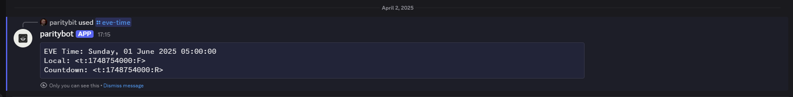
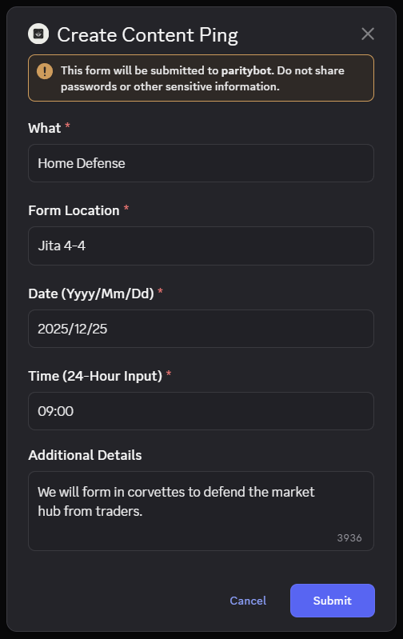
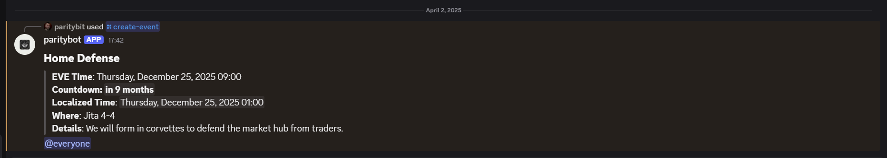

# Coordinated Time Bot

The Coordinated Time Bot is a simple application to ease the pain of coordinating events across time zones. The bot was developed with EVE Online in mind, but EVE uses [Coordinated Universal Time](https://en.wikipedia.org/wiki/Coordinated_Universal_Time) so it would be relatively straightforward to think of EVE time as UTC and use the bot more generically.

The bot has two primary functions with a handful of supporting an alternate commands. 

The primary function is to provide a simple way to generate [Discord Timestamps](https://discordtimestamp.com/) without using web site or tabbing to another application.

The secondary function facilitates pinging a channel with details about an event. The bot supports a form variant of this function as well as a simple parameterized command. The parameterized command is more flexible while the form is intended to be simple to use.

## Coordinated Timestamp Generation

To generate a coordinated set of time stamps which includes UTC, localized time for the user and a countdown, use the `/eve-time` command. The following command generates an ephemeral message with the three timestamps formatted as code so it can be easily copied and pasted.

```
| /eve-time time:05:00 date:2025/06/01 display:CopyableEphemeral
```


Using the `display` parameter allows the user to specify the timestamp should be sent to the current channel or presented to the user as an ephemeral message -- the ephemeral message is the default if no value is given.

The date is optional; if no date is provided, the next future instance of the provided time will be used.

## Event Pings

An event can be pinged in the local channel using a form (`/create-event`) or the parameterized command (`/create-event-cli`). The following images show the form and resulting content ping.





## Hosting the Bot

This repository contains the code and supporting Dockerfile to generate a container (provided you have that knowledge). Once the container is built you can host it anywhere wherever you like. There is no requirements for an outside application to communicate with the bot as it communicates outward to Discord. The container needs the Discord Bot token in an environment variable called `DISCORD_TOKEN`. If the health check is necessary the bot will also need to provide the `ASPNETCORE_URLS` environment variable for the HTTP /health endpoint (this can typically be the value `http://0.0.0.0:8080`).
